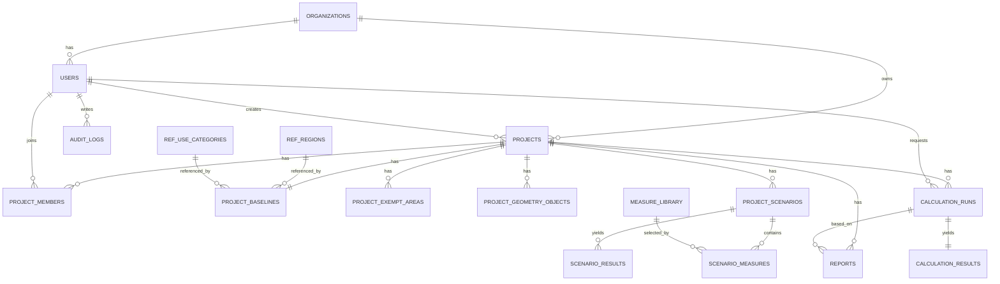

# BERN3 ER Model（資料實體關聯）

## 1. ER 圖（Mermaid）

## 2. 實體說明
- `organizations`：機關/廠商主檔。
- `users`：平台帳號與角色。
- `projects`：專案主檔（儀表板與入口）。
- `project_baselines`：計算所需基線資料（Envelope/MEP/HVAC mode 等）。
- `project_geometry_objects`：3D 幾何物件與參數。
- `calculation_runs`：每次計算任務與狀態。
- `calculation_results`：EEI/SCOREee/grade 等輸出。
- `project_scenarios` + `scenario_measures`：方案組合。
- `scenario_results`：方案模擬結果。
- `reports`：報表輸出紀錄。
- `audit_logs`：稽核與追蹤。

## 3. 關聯基準
- 一個專案僅有一份當前 `baseline`（若要歷史版本可再加 `project_baseline_versions`）。
- 計算歷史採 `1 project : N runs`。
- 每個 run 對應一筆結果 `1:1`（失敗 run 可無結果）。
- 方案可重複使用 measure library（多對多）。
