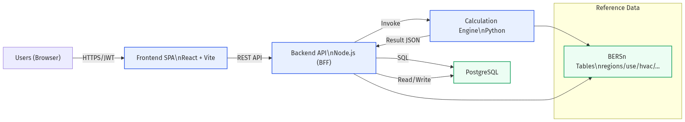
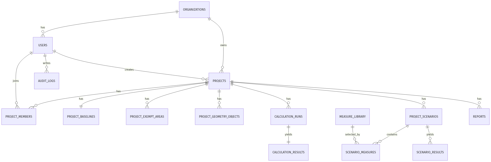
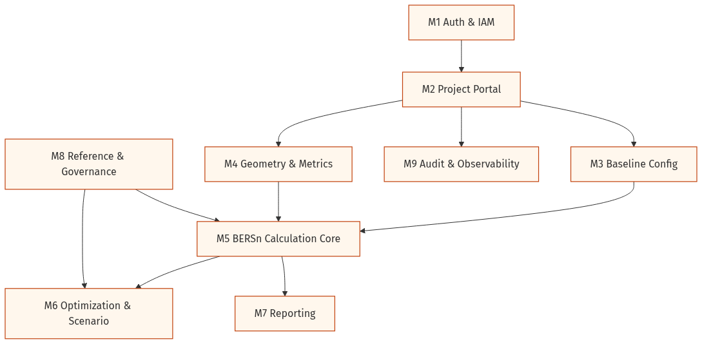

# BERN3 系統架構與資料設計整合文件（含圖文）

日期：2026-03-10  
專案：`/Users/yuhueisheng/Projects/antigravity/bern3`

## 1. 目的與範圍

本文件整合 BERN3 現況程式盤點結果，並提供可落地的後端化設計，包含：
- 系統架構（As-Is / To-Be）
- 資料庫 Table Schema 規劃
- API 文件規劃（OpenAPI）
- ER Model
- 模組說明與開發順序

## 2. 現況架構盤點（As-Is）

### 2.1 現況技術
- 前端：React + Vite + TypeScript（單一 SPA）
- 計算：`services/calculationEngine.ts`、`services/optimizationEngine.ts`
- 參數：`data/bersn_tables/*.json`
- 專案/帳號資料來源：前端樣本資料（`SAMPLE_PROJECTS`、`SAMPLE_USERS`）

### 2.2 現況缺口
- 尚無後端 API（未見 `fetch/axios` 對外呼叫）
- 尚無資料庫持久化與計算履歷
- 權限（RBAC）仍在前端展示層，未後端化
- 計算核心存在兩套（`services/*` 與 `lib/calc/*`），未統一版本治理

## 3. 目標系統架構（To-Be）

採三層式架構：
- 應用層：Frontend SPA（React）
- 服務層：Node.js API/BFF（Auth、Project、Scenario、Report、Audit）
- 計算層：Python Calculation Engine（EEI/SCOREee/模擬）
- 資料層：PostgreSQL（主檔、參數、履歷、審計）

### 3.1 資料流摘要
1. 使用者登入取得 JWT。
2. 建立/編輯專案基線與幾何資料。
3. 呼叫 `POST /projects/{id}/calculate`。
4. Node.js 封裝輸入並調用 Python 引擎。
5. 回寫 `calculation_runs`、`calculation_results`，前端顯示結果。

## 4. Table Schema 規劃

完整 SQL 請見：`02-table-schema.sql`。  
以下為核心資料表分組：

### 4.1 身分與專案主檔
- `organizations`
- `users`
- `projects`
- `project_members`

### 4.2 計算輸入資料
- `project_baselines`
- `project_exempt_areas`
- `project_geometry_objects`

### 4.3 計算與輸出
- `calculation_runs`
- `calculation_results`
- `reports`
- `audit_logs`

### 4.4 優化方案與策略
- `measure_library`
- `project_scenarios`
- `scenario_measures`
- `scenario_results`

### 4.5 參數字典（Lookup）
- `ref_regions`
- `ref_use_categories`
- `ref_constructions`
- `ref_glazing_types`
- `ref_shading_types`
- `ref_hvac_systems`
- `ref_lighting_systems`
- `ref_dhw_systems`
- `ref_grade_thresholds`

## 5. ER Model

ER 關聯要點：
- `Project` 對 `Baseline` 為 1:1。
- `Project` 對 `CalculationRun` 為 1:N。
- `CalculationRun` 對 `CalculationResult` 為 1:1（成功任務）。
- `Scenario` 與 `Measure` 為多對多（`scenario_measures`）。

## 6. API 規劃（OpenAPI）

完整 OpenAPI：`03-api-spec.yaml`。

### 6.1 API 分類
- Auth：`/auth/login`, `/auth/me`
- Users：`/users`, `/users/{userId}`
- Projects：`/projects`, `/projects/{projectId}`
- Baseline/Geometry：`/projects/{projectId}/baseline`, `/projects/{projectId}/geometry`
- Calculation：`/projects/{projectId}/calculate`, `/projects/{projectId}/calculations`
- Scenarios：`/projects/{projectId}/scenarios`, `/projects/{projectId}/scenarios/{scenarioId}/simulate`
- Reference：`/reference/regions`, `/reference/use-categories`, `/reference/measures`
- Reports：`/projects/{projectId}/reports`

### 6.2 關鍵 API 設計原則
- 全 API 採 JWT Bearer。
- 計算支援同步與非同步（`mode: sync/async`）。
- Calculation 結果需完整回傳中間計算分解（weights、EEV、MEP breakdown）。
- 所有寫入操作需寫入審計紀錄。

## 7. 模組說明

### 7.1 模組清單
- M1 認證與帳號管理
- M2 專案入口與管理
- M3 基線設定
- M4 幾何建模與指標
- M5 BERSn 計算核心
- M6 優化模擬
- M7 報告產出
- M8 參數字典與治理
- M9 稽核與追蹤

### 7.2 建議開發順序
1. M1 + M2（先完成登入與專案 CRUD）
2. M3 + M4（完成計算輸入持久化）
3. M5（串接 Python 計算服務）
4. M6（方案模擬與 CP 排序）
5. M7 + M9（報表與審計治理）

## 8. 交付檔案索引

- 架構盤點：`01-architecture-review.md`
- Table Schema：`02-table-schema.sql`
- API 文件：`03-api-spec.yaml`
- ER 文件：`04-er-model.md`
- 模組說明：`05-module-description.md`
- 本整合文件：`BERN3_系統架構與資料設計整合文件.md`

## 9. 實作建議（下一步）

- 先建立 Node.js API 專案骨架並掛上此 OpenAPI。
- SQL schema 先建 staging DB，完成 migration 與 seed（參數字典）。
- 前端替換 `SAMPLE_*` 為 API 來源，優先串專案列表與計算結果頁。
